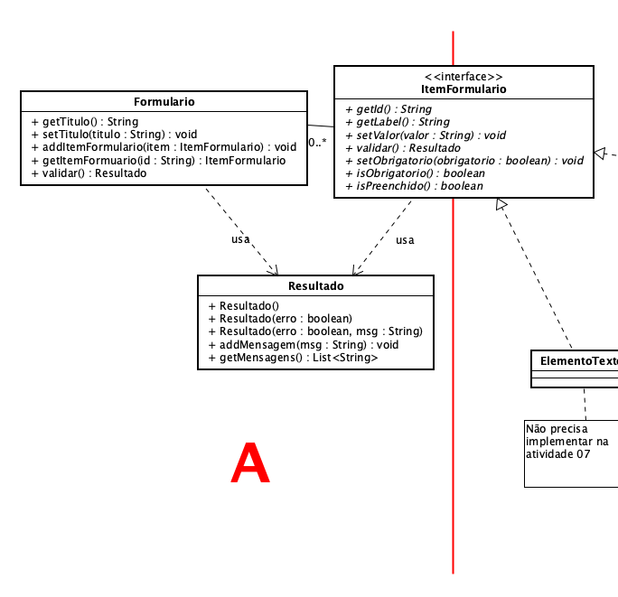
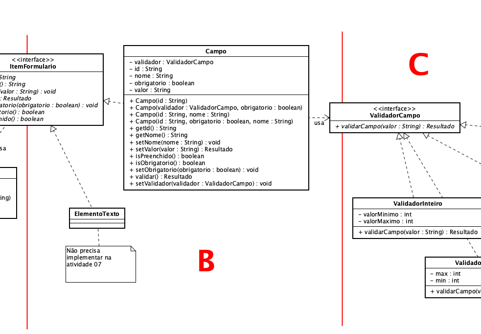
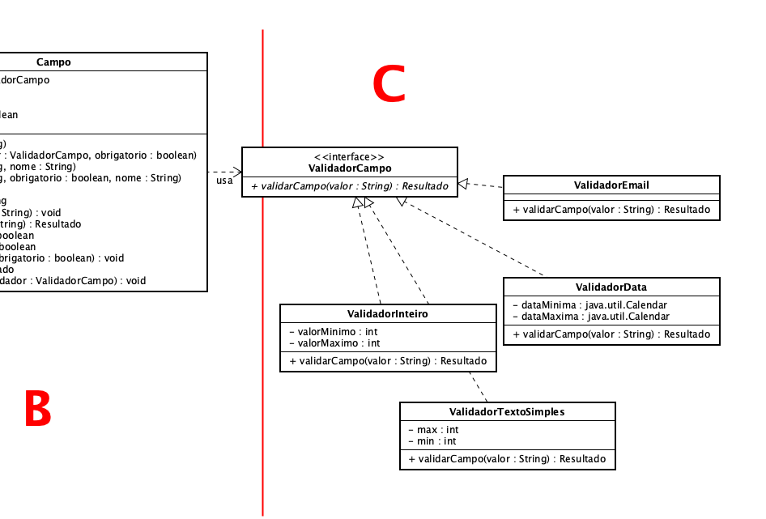

**Universidade Federal da Paraíba - UFPB** \
**Centro de Ciências Exatas e Educação - CCAE** \
**Departamento de Ciências Exatas - DCX**

**Professor:** [Rodrigo Rebouças de Almeida](http://rodrigor.dcx.ufpb.br)

# Atividade 07

* Implemente o padrão Strategy para validação dos campos, conforme diagrama a seguir.
* Observação: Você deve concluir a atividade 06 antes de iniciar esta atividade.
* Os testes devem passar.

